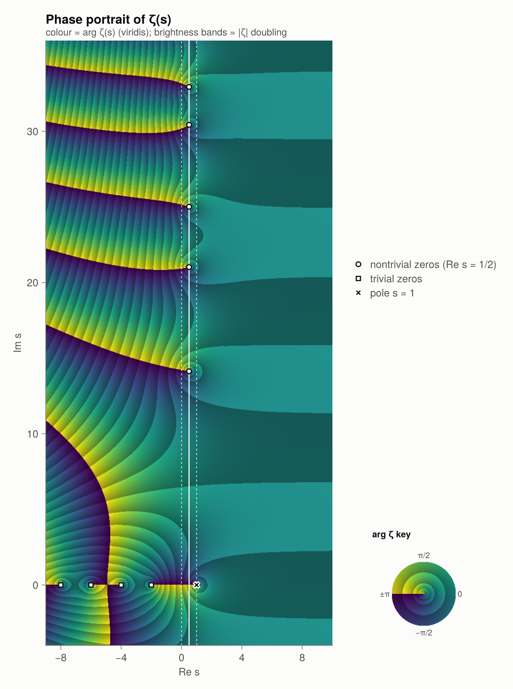
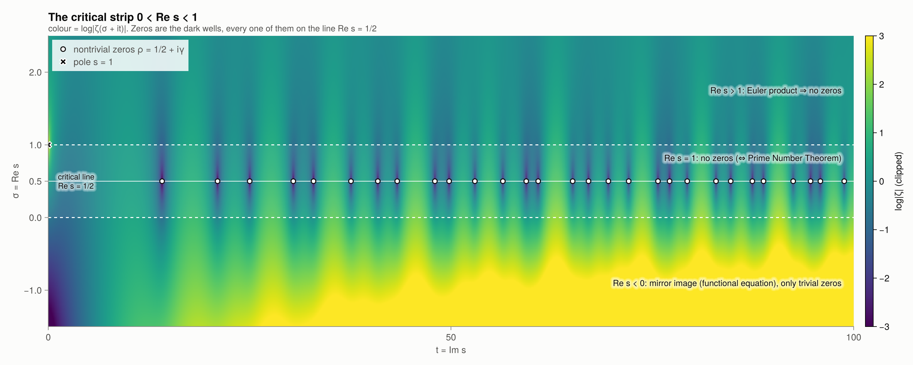
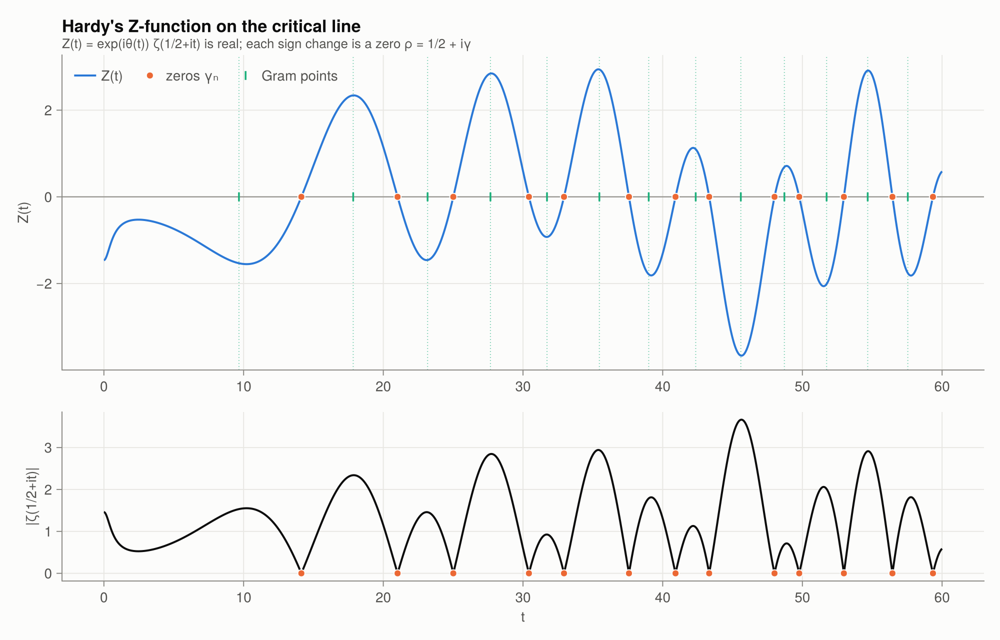
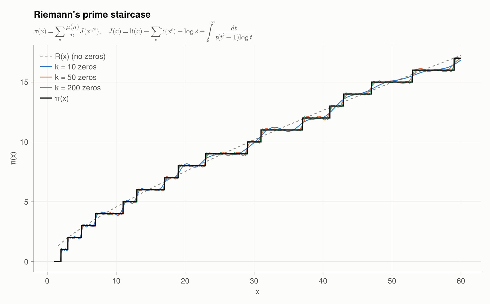
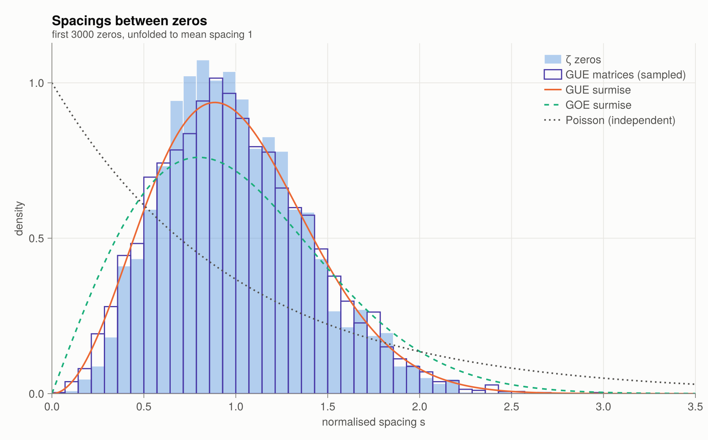
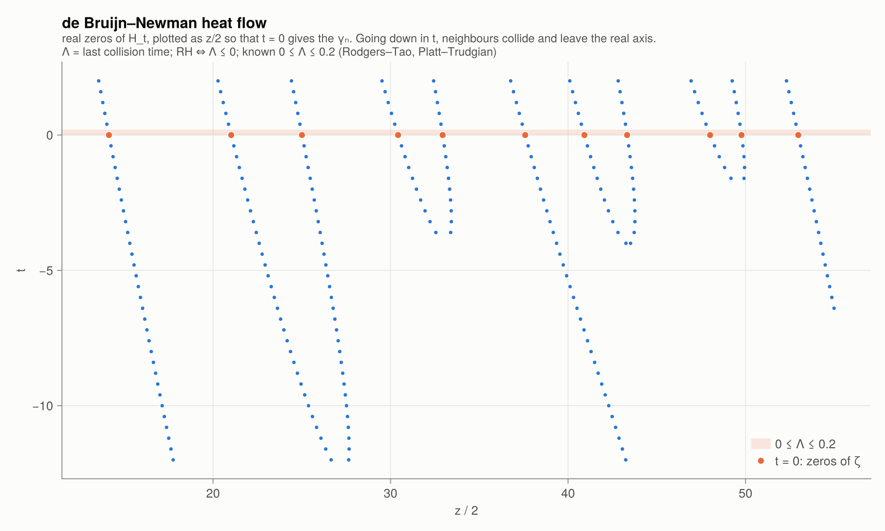
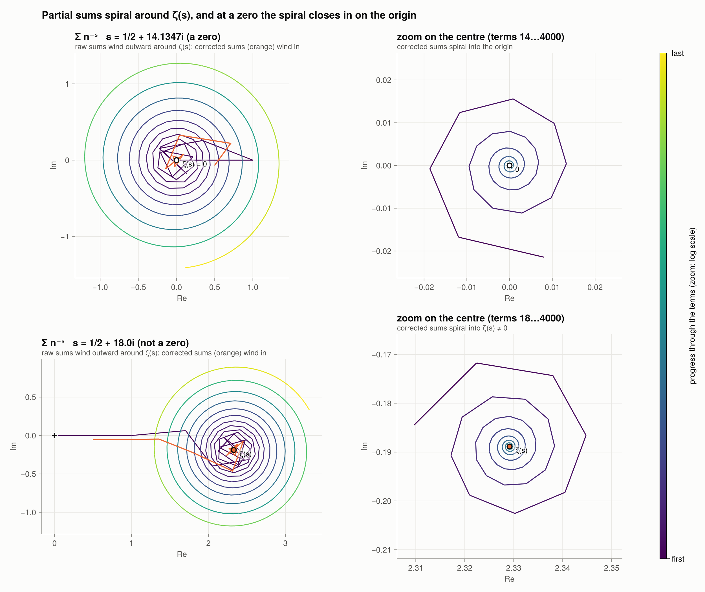
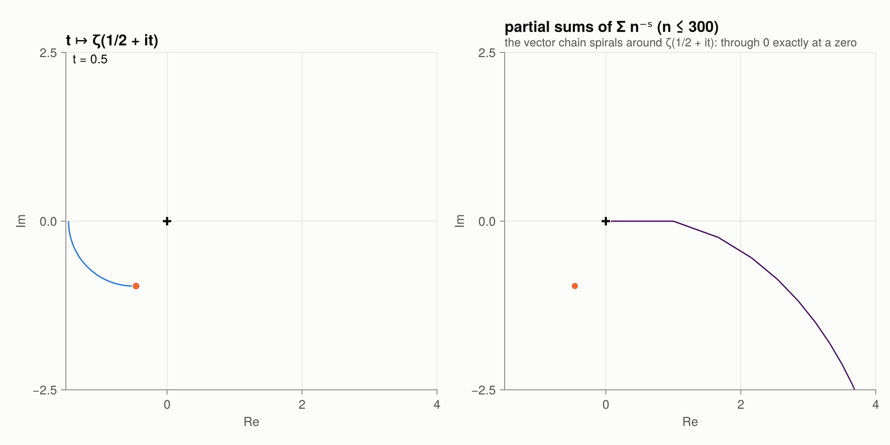

# Riemannian.jl

[](https://geekymode.github.io/Riemannian.jl/dev/)
[](https://github.com/geekymode/Riemannian.jl/actions/workflows/CI.yml)
[](https://github.com/geekymode/Riemannian.jl/actions/workflows/Documentation.yml)

📖 **Documentation:** <https://geekymode.github.io/Riemannian.jl/dev/>. It has ten narrative chapters with
runnable examples, a gallery, notes on the numerical methods, and the full API reference.

A Julia study kit for the **Riemann Hypothesis**: from primes and the Euler product, through analytic
continuation and the functional equation, to trivial and nontrivial zeros, explicit formulas,
random-matrix statistics, equivalent criteria and recent results. Plotting uses **CairoMakie**.



## Quick start

```julia
julia> ] add https://github.com/geekymode/Riemannian.jl
julia> using Riemannian
julia> explain()                       # reading list
julia> explain(:trivial_zeros)
julia> zeta(0.5 + 14.134725141734693im)     # ≈ 0
julia> nontrivial_zeros(5)
julia> check_zeros(1000)               # all 649 zeros up to T = 1000 are on the line

julia> using CairoMakie                # loads the plotting extension
julia> plot_domain_coloring()
julia> gallery("figures")              # renders all 21 figures
```

`examples/tour.jl` walks through every chapter. The numerics have no plotting dependency.
CairoMakie is a weak dependency, and `using CairoMakie` activates `ext/RiemannianCairoMakieExt.jl`.

## Contents

| Chapter | Functions |
|---|---|
| **1. Primes** | `sieve` `isprime` `primepi` `nthprime` `factorize` `prime_gaps` `twin_primes` `li` `Li` `riemann_R` |
| Arithmetic functions | `mobius` `mertens` `liouville` `vonmangoldt` `chebyshev_theta` `chebyshev_psi` `totient` `divisor_sigma` |
| **2. ζ on the real line / Euler** | `bernoulli` `zeta_even_exact` `zeta_negint_exact` `dirichlet_partial` `euler_product_partial` |
| **3. Analytic continuation** | `eta_partial` `zeta_borwein` (η-series) · `zeta_em` (Euler–Maclaurin) · `zeta` (any s, any float type incl. `BigFloat`) · `chi_factor` · `completed_zeta` · `xi` · `Xi` |
| **4. Trivial zeros** | `trivial_zeros`, exact `ζ(−n)` via Bernoulli numbers, `explain(:trivial_zeros)` |
| **5. Nontrivial zeros** | `riemann_siegel_theta` `hardy_Z` `riemann_siegel_Z` `gram_point` `gram_law_violations` `argzeta_S` `zero_count` `zeros_between` `nontrivial_zeros` `check_zeros` `close_pairs` `zero_free_boundary` `RH_VERIFIED_HEIGHT` |
| **6. Explicit formulas** | `psi_explicit` `riemann_J` `riemann_J_explicit` `primepi_explicit` |
| **7. Random matrices** | `normalized_spacings` `pair_correlation` `wigner_gue` `wigner_goe` `montgomery_pair_correlation` `gue_spacings` |
| **8. Equivalents & bounds** | `robin_violations` `lagarias_violations` `li_coefficient` `LI_LAMBDA1` `mertens_ratio_max` `zero_density_exponents` |
| **9. de Bruijn–Newman** | `debruijn_Phi` `debruijn_H` `heat_flow_zeros` |
| **10. History** | `breakthroughs` `timeline` `explain` |

### Plots (all return a `Figure`)

`plot_prime_counting` · `plot_prime_gaps` · `plot_chebyshev` · `plot_mertens` · `plot_euler_product` ·
`plot_zeta_real` · `plot_analytic_continuation` · `plot_domain_coloring` · `plot_modulus_surface` ·
`plot_critical_line` · `plot_zeta_spiral` · `plot_zero_counting` · `plot_xi` · `plot_explicit_formula` ·
`plot_prime_staircase` · `plot_spacing_distribution` · `plot_pair_correlation` · `plot_robin` ·
`plot_zero_density` · `plot_heat_flow` · `plot_timeline` · `plot_critical_strip` · `plot_strip_schematic` ·
`plot_strip_width` · `plot_partial_sum_spiral` · `plot_zeta_near_origin` · `record_zeta_spiral` (animated GIF) ·
`gallery`

Continuous colour scales use **viridis**.



| | |
|---|---|
|  |  |
|  |  |
|  |  |

## How it works (numerics)

- **ζ(s)** uses Euler–Maclaurin summation, with N and M chosen from |s| and the float precision. For Re s < 0 it
  uses the functional equation, with a stable `log sin` so large |t| doesn't overflow. It agrees with
  SpecialFunctions.jl to about 1e-13 and works with `BigFloat`.
- **Zeros** are found as sign changes of Hardy's Z(t), refined by the Illinois method. Each block is
  checked against N(T) = θ(T)/π + 1 + S(T), with S(T) tracked continuously by the argument principle. If the
  counts disagree (for example at a Lehmer pair), the grid is refined. 5000 zeros take a few seconds.
- **H_t (de Bruijn–Newman)** uses the trapezoidal rule in BigFloat. H_t(z) is about e^{−πz/8}, far smaller
  than the integrand, so Float64 cancellation would wipe it out.

## Tests and docs

```
julia --project -e 'using Pkg; Pkg.test()'
julia --project=docs docs/make.jl        # builds docs/build/
```
